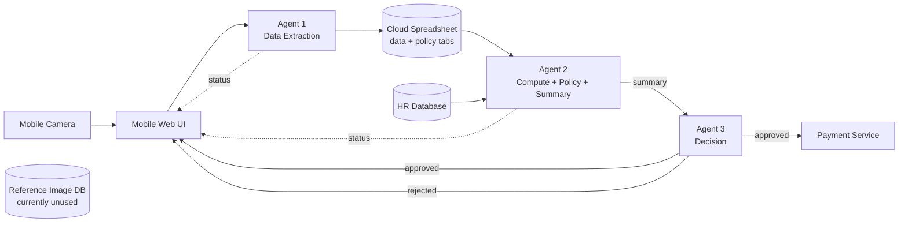

# Step 1: System Overview

> The course rubric does not require a written submission for this step. This doc exists in the repo because the architecture is the foundation every later step builds on — a portfolio visitor needs the shared mental model too.

## Components

- Mobile web UI
- Mobile camera
- Agent 1 — data extraction
- Agent 2 — computation, policy analysis, summarisation
- Agent 3 — decision-making
- Third-party payment service

## Data stores

- **Reference image database** — a database of allowable receipt reference images. Listed as a system component but not consulted in the current flow.
- **Cloud-hosted spreadsheet** — split into two tabs:
  - `data` tab — where extracted expense data is written by Agent 1.
  - `policy` tab — company expense policies that Agent 2 checks each report against.
- **HR database** — employee role and status information, read by Agent 2 to enrich its summary for Agent 3.

## System flow

1. The employee opens the mobile web UI on their phone, photographs the receipt with the mobile camera, and submits the expense report.
2. **Agent 1** extracts transaction data from the receipt image and writes it to the spreadsheet's `data` tab.
3. **Agent 2** reads the captured data from the spreadsheet, applies the policies defined in the `policy` tab, and consults the HR database for the employee's role. It computes the receipt total and produces a summary with an `approve` or `reject` recommendation, including the reasoning.
4. **Agent 3** reviews Agent 2's summary and makes the final call:
   - **Approved** → triggers the third-party payment service to reimburse the employee, and notifies the user via the mobile web UI.
   - **Rejected** → returns an error message to the employee via the mobile web UI, with an explanation.

## Playbook lens — Phase 0

### Capabilities

| Agent | Perceive | Reason | Act | Remember |
|---|---|---|---|---|
| Agent 1 — data extraction | ✓ | ✓ | ✓ | ✗ |
| Agent 2 — computation + policy + summary | ✓ | ✓ | ✗ | ✓ |
| Agent 3 — decision-making | ✓ | ✓ | ✓ | ✗ |

Notes:

- Agent 1 doesn't need Remember — each receipt is processed independently, no state is carried between images.
- Agent 2 needs Remember — it has to hold many receipts in working memory to sum the total and check each one against the policy tab.
- Agent 2 doesn't Act on the world — its summary is handed directly to Agent 3 with no persistent write.
- Agent 3 doesn't need Remember — single summary in, single decision out, no aggregation.

### Autonomy spectrum

The current system sits at **fully autonomous**. There is no human in the loop. Agent 3 makes the final reimbursement call and triggers the payment service for any amount, without consultation. The playbook flags this position as unusual — most successful business agents sit in the middle of the spectrum, with the agent doing the work and a human keeping the final say. This is the gap Step 3 is going to close (human review for any expense over $500).

## Architecture diagram

The dotted lines from Agent 1 and Agent 2 back to the mobile UI represent the status/feedback channel each agent reports through (progress updates while the report is being processed). Only Agent 3's rejection message is explicitly specified in the project documentation; the other two channels are implied by the course diagram convention.
