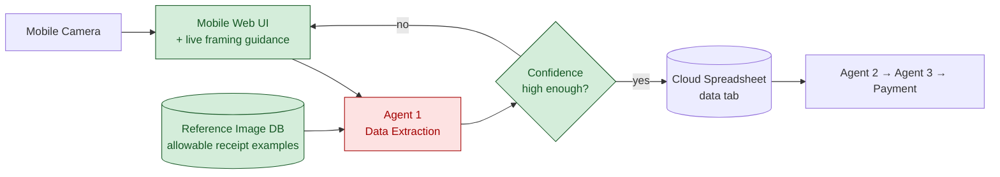

# Step 2: Find and Fix a Bug

## Submission

### Location

Agent 1, in its **reason** step — the moment it extracts structured transaction data (vendor, date, amount, currency, line items) from a receipt image.

### Problem

Hallucination is an artifact of the *reason* capability operating on unclear *perception* input. When Agent 1 photographs a receipt that is blurry, poorly lit, in an unfamiliar language or currency, or laid out in an unusual format, the underlying LLM does not have a clean signal to extract from. Instead of flagging the uncertainty, it invents plausible-looking values to complete the goal.

That hallucinated data is then written straight into the spreadsheet's `data` tab. From there the failure cascades silently through the rest of the system:

- **Agent 2** trusts the spreadsheet and computes a total, runs the policy check, and produces a summary against fabricated numbers.
- **Agent 3** trusts Agent 2's summary and makes a reimbursement decision against fabricated numbers.
- **Outcome:** either the company overpays the employee (financial loss) or the employee is underpaid (unhappy employee, manual rework). Either way, the wrong amount of money moves, and no component in the chain knows anything is wrong.

This is the silent-failure / cascade pattern: a single unflagged uncertainty at the *perceive → reason* boundary corrupts every downstream step.

### Solution

Combine three layered guardrails. **(1)** The mobile UI gives the user live framing guidance during capture — lighting checks, distance prompts (move the phone closer or further away), and supported-language hints — so most low-quality images are prevented at the source. **(2)** Agent 1 grounds its extraction against the Reference Image Database of allowable receipt examples, which lets it produce a *measurable* confidence score rather than an LLM self-assessment. **(3)** Low-confidence extractions are routed back to the user for re-capture or manual review and are never written to the spreadsheet — blocking hallucinated data at the failure boundary, before any downstream agent can act on it.

## Reasoning

### Why Agent 1's reason step, and not somewhere else

Hallucination is specifically a *reason* failure mode. The other capabilities can fail in their own ways (a broken camera fails *perceive*, a payment API outage fails *act*), but only *reason* invents content that wasn't in the input. Agent 2 and Agent 3 also have *reason*, but they reason over already-structured data coming from the spreadsheet — there's no unclear perceptual input for them to hallucinate against. Agent 1 is the only place in the pipeline where a model is asked to turn a noisy image into structured fields, which is exactly the condition that produces hallucinations.

### Why catch it before the spreadsheet write, and not later

Catching the bug only by spot-checking outputs (e.g. someone notices their reimbursement is wrong) is too late — the money has already moved. The fix has to sit *before* Agent 1 writes to the spreadsheet, because the spreadsheet is the system's source of truth from that point on. Once a hallucinated row is in `data`, every downstream agent's reasoning is built on it.

### Why a confidence score alone is not enough — and what the Reference Image DB unlocks

A naive confidence score is the LLM grading its own homework. The whole nature of a hallucination is that the model is *confidently* wrong — so asking the same model "how sure are you?" is a circular check. The Reference Image Database (documented in Step 1 as present in the architecture but not currently consulted) is what makes the score trustworthy: it gives Agent 1 a known-good corpus to ground its extraction against, so confidence becomes a measurable similarity to allowable receipt patterns rather than a self-assessment. That is why the chosen solution activates the Reference DB rather than just adding a confidence number.

### Why also the UI layer

UI guidance is the cheapest fix in the stack — it prevents bad input from entering the system at all. Every receipt that the user re-frames before submitting is one that Agent 1 never has to reason about under uncertainty, one fewer reference-DB lookup, and one fewer round trip back to the user. It is poka-yoke (mistake-proofing) at the source.

## Diagram

Red = the location of the bug (Agent 1's reason step). Green = the three layered fixes: live UI guidance at capture, Reference Image DB grounding, and the confidence-score gate before the spreadsheet write. The gate is the failure boundary the system was missing.
