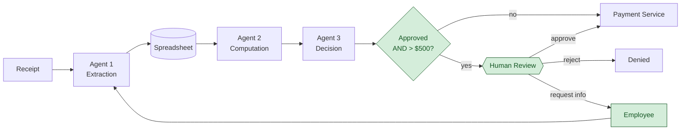

# Step 3: Add Human Review

## Submission

### Location

Between **Agent 3** (the decision agent) and the **payment service** — the last boundary before money moves. The human is triggered only when Agent 3 has **approved** an expense **over $500**. Approved expenses of $500 or less, and any expense Agent 3 rejected, continue to flow autonomously and never reach the human.

### Decision

The human reviewing an approved, over-$500 expense has three outcomes:

- **Approve** — release the expense to the payment service. *(Terminal.)*
- **Reject** — block the payment; the expense is denied. *(Terminal.)*
- **Request more information** — the available data is insufficient to decide. Route back to the **employee** for new input (a clearer receipt, an itemized breakdown, an explanation); the expense then re-enters the workflow and is re-evaluated. *(Non-terminal — loops back.)*

### Data

Everything the human needs is already present at this boundary — that is *why* the checkpoint sits after Agent 3. At the point of review the human can inspect:

- the **original receipt image** (the raw input),
- **Agent 1's extracted fields** (vendor, date, amount, currency, line items) — checkable against the receipt,
- **Agent 2's computed total and policy-check result**,
- **Agent 3's decision and its reasoning**.

No new component or back-channel is required to source this; the human reads what the pipeline has already produced. The only information *not* already on the table is anything that requires the employee — which is exactly what the *request more information* path exists to fetch.

## Reasoning

### Why between Agent 3 and the payment service, and nowhere else

The insertion point has to satisfy two conditions at once: **(a)** enough information exists to judge the expense, and **(b)** the irreversible step hasn't happened yet. Only this boundary passes both. Earlier than Agent 3, condition (a) fails — Agent 3's decision doesn't exist yet, so the human would be reviewing an incomplete picture. After the payment service, condition (b) fails — the money is gone and review becomes a post-mortem, not a gate. The boundary right before payment is the single point where the human has the complete picture *and* can still stop the only action that can't be undone.

### Why review only Agent 3's approvals, not its rejections

The risk worth spending human attention on is the **irreversible** one: money leaving the account on an expense that shouldn't have been paid — i.e. a wrongly *approved* large expense. A wrongly *rejected* expense is the opposite kind of failure: nothing irreversible has happened, the employee simply isn't reimbursed yet, and they can appeal or resubmit through the normal channel. It is recoverable. So the gate is aimed deliberately at the failure that can't be taken back, and human attention — the scarce, expensive resource — isn't spent on the one that can.

### Why *request more information* is a third outcome, not a flavor of reject

Approve and reject are both terminal — the expense leaves the workflow. *Request more information* is structurally different: it is non-terminal and routes *backward*. It exists because "I can't decide yet" is a distinct state from "no." Collapsing it into reject would deny legitimate expenses purely for having an unclear receipt, and would push correction onto an appeals process instead of resolving it inline.

### Why the back-route goes to the employee, not back through Agent 1

Re-running Agent 1 produces nothing new — it extracts from the *same* receipt, so it yields the *same* fields. The only actor in the system that can generate genuinely new information is the **employee**. "Consulting the data already available" isn't a loop at all; it's just the human reading the receipt and agent outputs that the checkpoint already puts in front of them. So the only backward route that adds information is the one to the employee.

### Considered and deferred: escalation

A fourth outcome — *escalate* to a legal or credit team — was considered. Escalation answers a different question than the others ("is this my decision to make?" rather than "do I have enough information?") and would be legitimate where the data is complete but the call exceeds the reviewer's authority (suspected fraud, a policy gray area, an amount above their limit). It was deferred because this system does not define a distinct higher authority to escalate *to* — adding the branch would create a route with no clear owner. It is noted here as a deliberate scoping decision rather than an omission.

### Playbook lens

- **Phase 3 — Guardrails:** this is a *behavioural / escalation* guardrail — a rule that decides when an action may proceed autonomously versus when it must be held for a human.
- **Progressive authorization ladder** (read → draft → supervised → autonomous): Step 3 pulls Agent 3's reimbursement decision back from *autonomous* to *supervised*, but only above the $500 threshold. Low-value expenses keep their autonomy; the high-value, irreversible ones are gated. This is the follow-through on the autonomy-spectrum gap flagged in Step 1.

## Diagram

Green = what Step 3 adds: the **gate** that tests Agent 3's output (approved *and* over $500), the **human review** checkpoint, and the **employee** back-route for the request-more-information path. Note the one non-terminal exit — *request info* loops back into the pipeline rather than ending the flow; approve and reject are both terminal.
