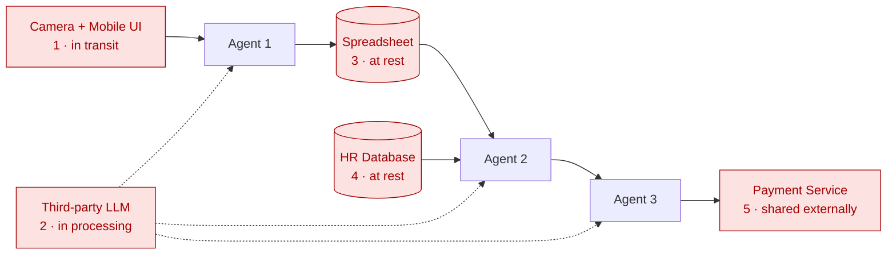

# Step 4: Ensure Customer Privacy

## Submission

### Location

_Which parts of the system could compromise customer privacy? (Identify five.)_

Personal data is at risk at every stage of its life — when it is **transmitted**, when it is **processed**, when it is **stored**, and when it is **shared**. Reading the workflow through that lens, five parts of the system could compromise privacy, one per stage:

1. **Camera and Mobile UI** — the receipt enters the system here and is transmitted from the device to the backend. *(in transit)*
2. **Agents 1, 2 and 3** — processing of personal data, including exposure to third-party LLMs and to logs. *(in processing)*
3. **Spreadsheet** — extracted expense data is stored here. *(at rest)*
4. **HR database** — employee data an agent reads from. *(at rest)*
5. **Payment service** — an external provider receives shared data to process the payment. *(shared externally)*

### Solution

_What specifically would you change to protect customer privacy?_

Because this is EU data, the solution is anchored in six GDPR principles:

1. **Data minimisation** — collect, store, send and read only what is necessary.
2. **Purpose limitation** — use the data only for reimbursement.
3. **Storage limitation** — keep data only for a defined retention period.
4. **Security** — encryption and restricted access.
5. **Data residency / international transfers** — keep EU data in the EU.
6. **Data deletion on request** — honour the employee's right to erasure.

Applied per surface:

**1. Camera and Mobile app**
- Transfer of data should be encrypted from the device to the backend system, and the receipt should not linger on the device longer than needed.
- Access should be restricted.

**2. Agents**
- The information extracted should be limited to only what is necessary.
- Logs should also limit the amount of information they retain.
- The LLMs used should carry a **non-training clause** — so receipt data is never used to train the provider's AI models — recorded in the data processing agreement.
- The agents' data processing should be done in the EU.

**3. Spreadsheet**
- Store only what is necessary — e.g. only the **last 4 digits** of the card, for fraud checks, never the full number.
- Data should be encrypted and access-restricted.
- Data should be kept only for a defined retention period.
- Data must be stored in the EU.

**4. HR database**
- Read only what is necessary — employee **role and status** only.
- Data should be encrypted and access-restricted.
- Data should be kept only for a defined retention period.
- Data must be stored in the EU.

**5. Payment service**
- The external service should receive only the information necessary to process the payment.
- The transfer should be encrypted and access-restricted.
- The provider needs a **data processing agreement** binding it to use the data only for processing.
- Processing must happen inside the EU.

**Across all five surfaces:** an employee's data-deletion request must be honoured.

## Reasoning

### Why a lifecycle lens, not a component checklist

Listing "risky components" off the top of one's head tends to find the obvious *stores* and miss everything else. Personal data is exposed wherever it **moves, is worked on, sits, or leaves** — captured → transmitted → processed → stored → shared. Walking the workflow against those stages is what surfaced the two that are easy to forget: the **upload** (data in transit, before any agent touches it) and the **agents themselves** (data fed into models and written to logs). Each of the five owns a distinct stage, which is why the list is five and not "however many components we happened to recall."

### The through-line: minimise everywhere

The single most repeated control is **data minimisation**, and it shows up at four of the five surfaces in four different forms:

- **send less** — the payment service gets only what it needs to pay;
- **store less** — the spreadsheet drops the full card number (keeps only last 4 for fraud);
- **log less** — agent logs are trimmed and scrubbed of personal data;
- **read less** — the agent pulls only role + status from the HR database.

The safest data is the data you never hold. Minimisation is cheaper and more robust than trying to perfectly secure data you didn't need to have.

### The outside-party rule: a DPA, not a promise

Two surfaces hand personal data to an **external company** — the **LLM provider** and the **payment service**. In GDPR terms the company is the *data controller* and each of these is a *data processor*, which legally requires a **Data Processing Agreement**: a signed contract binding the processor to use the data only for the stated purpose, protect it, delete it on instruction, and not pass it on. "The vendor is GDPR compliant" is only meaningful if that DPA exists — it is the artifact that turns trust into a legal obligation.

### Why the no-training clause is the sharpest control

An LLM provider differs from a payment processor in one dangerous way: AI models improve by **training on the data that flows through them**. If employees' receipts are used for training, that data is **absorbed into the model and cannot be extracted** — which directly defeats the employee's **right to erasure**. A "delete my data" request becomes impossible to honour. So the DPA must explicitly **forbid using the data for training**. This is the one control with no clean technical undo, which is exactly why it has to be prevented contractually, up front.

### Playbook lens

- **Phase 6 — Govern:** this step is governance applied to personal data — minimisation, purpose limitation, retention, and access control are the *control toolkit* turned toward privacy rather than correctness.
- **Least privilege:** the HR-database fix (read only role + status) and the access restrictions throughout are the security principle of granting the minimum access required — applied to *reading*, *storing*, and *sharing* alike.

## Diagram

Red marks the five privacy-exposure surfaces, each labelled with the lifecycle stage it owns: **(1)** the upload in transit, **(2)** the agents' processing (the third-party LLM, dotted because it serves all three agents), **(3)** the spreadsheet at rest, **(4)** the HR database at rest, and **(5)** the payment service where data is shared externally.
