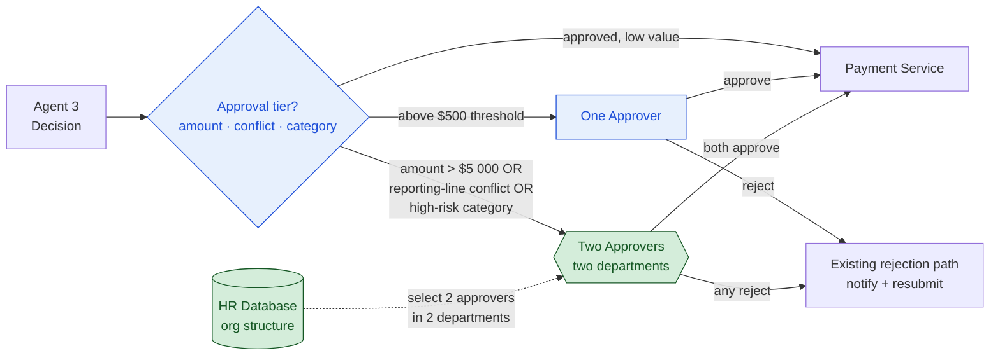

# Step 5: Extend the Workflow

Candidate capabilities from the course brief:
- Pay via Bitcoin
- Export an employee's transaction history to a spreadsheet
- Enable an employee to recategorize a past expenditure
- Enable expense itemization so one person can pay for a group outing with a single expense report
- In special situations, require approval by two people in two different departments

## Submission

### Capability

**Two-person approval (the "four-eyes principle") for high-value / high-risk expenses.** A two-person approval process requires sign-off from **two people in two different departments** before certain expenses are paid. A single approver remains sufficient for routine spending; the second approver is required only when an expense is higher-risk, by one of these criteria:

1. The amount is above **$5 000**.
2. The submitter is in the **approver's direct reporting line** (a conflict of interest — you don't want someone approving an expense for their own manager or report).
3. The expense falls in a **high-fraud-risk category** (gifts, customer dinners, entertainment, …).

(Value and effort are covered in Business Value and Reasoning below.)

### Location

This extends the **human-review gate added in Step 3** (which sits between Agent 3's decision and the payment service). It changes the gate logic and adds new approval behaviour, while running entirely on existing data and reusing the existing rejection path:

1. **Gate criteria (changed).** Step 3's single rule ("approved AND over $500 → one approver") becomes **tiered**:
   - approved and low value → straight to payment, as today (autonomous);
   - approved and above the Step 3 threshold → **one** approver;
   - approved **and** meeting any high-risk criterion (amount above $5 000, a reporting-line conflict of interest, or a high-fraud-risk category) → **two** approvers in two different departments.
2. **Risk signals (existing data only — no new source).** All three triggers run on data the system already has: the **amount** is computed by Agent 2, the **reporting-line conflict** is derived from the HR database's org structure, and the **category** is already extracted from the receipt. Deliberately, no new data store (e.g. a supplier registry) is introduced — the feature is built entirely on existing inputs.
3. **Approver selection via the HR database (new use of existing data).** "Two people in two different departments" is not free — the system has to *know* the org structure to choose them. So when the two-approver tier is triggered, the gate **consults the HR database** (the same store Agent 2 already reads) to identify two eligible approvers in two different departments and route a request to each. Consistent with Step 4, this read is **minimal**: only the department and identity/contact needed to route the approval, nothing more.
4. **Approval orchestration (new behaviour).** The gate routes the expense to the two selected approvers, **waits for both verdicts**, and applies the decision rule below. Each verdict is recorded (who, when, approve/reject) — an audit trail that, per Step 4, is itself access-controlled, retained for a defined period, and EU-hosted.
5. **Rejection path (reused).** A blocked expense follows the system's **existing** rejection flow — the employee is notified with the reason via the mobile UI and can correct and resubmit. No new reject machinery is needed.

**Decision rule — unanimous-blocks:** both approvers must approve for the payment to proceed; **any single rejection blocks it.** This needs no special "conflict" branch — a split verdict (one approve, one reject) and a double rejection land in the same place: blocked.

### Business Value

The value is **risk control on irreversible spend.** Money released on a fraudulent or mistaken large payment is effectively unrecoverable, so the highest-risk expenses are exactly where a single point of approval is most dangerous. Requiring two approvers from two departments:

- enforces **segregation of duties** — no single person can authorise and release a high-risk payment alone, which is a standard financial control and a strong deterrent against internal fraud;
- closes the **conflict-of-interest gap** — an expense can no longer be waved through by someone in the submitter's own management chain, since a reporting-line relationship forces a second approver from a different department;
- targets the **highest-risk categories** (gifts, entertainment, customer dinners) where misuse is most common, regardless of amount;
- improves the company's **audit and compliance posture** as the business scales, without adding friction to the everyday low-value expenses that make up most of the volume.

## Reasoning

### Why this capability, over the alternatives

All five candidates were scored on a value-vs-effort matrix, with a third column for whether they change the system's architecture (relevant because this repo doubles as a portfolio piece):

| Capability | Value | Effort | Changes architecture? |
|---|---|---|---|
| Pay via Bitcoin | Low / negative | Moderate (all payment-rail plumbing) | No |
| Export transaction history | Low | Low | No |
| Recategorize a past expense | Medium–High | High | Yes — backward loop + re-evaluation + already-paid exception |
| Itemization (group expense) | **High** | Low–Moderate | No — richer inputs + Agent 2 logic, same flow |
| **Two-person approval** | Medium–High | Moderate | **Yes** — extends the Step 3 gate into a multi-party gate |

Bitcoin and export were eliminated (low value). **Itemization scored highest on user-convenience value** and would be the natural pick on product grounds alone. It was deferred for two reasons: (1) it targets *convenience*, whereas two-person approval targets the highest-**risk**, irreversible exposure — losing money on a bad large payment is worse than the friction of splitting a group bill; and (2) itemization doesn't actually change the architecture (same workflow, richer inputs and Agent 2 logic), while two-person approval is a genuine structural extension. **Itemization is recorded here as the deferred runner-up** — the next capability to sequence.

### Why it's the right architectural extension

This capability is a direct continuation of Step 3. There, the human gate moved Agent 3's decision from *fully autonomous* to *supervised* above $500 — one approver. Here, the same gate is extended into a **multi-party** gate for the riskiest tier. The progression (autonomous → one approver → two approvers across departments) is a clean, legible escalation of control that maps to escalating risk.

### Why unanimous-blocks, and why it simplifies the design

The purpose of four-eyes is risk control, so the conservative rule is correct: **any rejection blocks.** This mirrors the Step 3 logic — it is better to wrongly hold a legitimate payment (recoverable; the employee resubmits) than to wrongly release a bad one (irreversible). It also collapses the conflict case: there is no need to design a tie-breaker, third approver, or escalation branch, because every non-unanimous outcome is simply a block. The safest rule is also the simplest to build.

## Diagram

Blue = the gate and single-approver path inherited from Step 3. Green = what Step 5 adds: the **two-approver, two-department** path for the high-risk tier (triggered by a high amount, a reporting-line conflict of interest, or a high-fraud-risk category — all from existing data), and the **HR database** consulted to select the two approvers from two different departments. Both the single-reject and double-reject outcomes route to the same existing rejection path (unanimous-blocks), so no new conflict-resolution branch is required.
