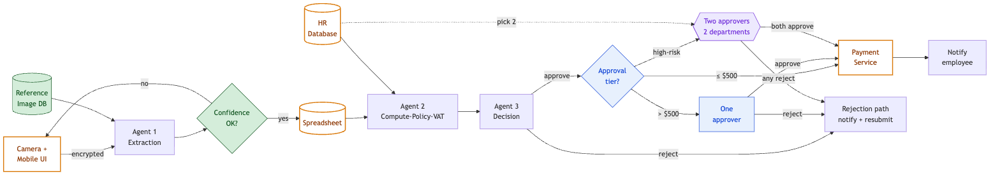

# Agentic Expense Reporting System

Project for the Udacity *AI Agents for Business Leaders* course.

You play the product leader hired to modernize the expense reporting process at a legacy industrial manufacturer. The course supplies a working agentic AI system — a mobile UI, three agents (extraction, computation, decision), and a third-party payment service — and the project asks you to find and fix a bug, add human review, secure PII for EU expansion, extend the workflow with a new capability, and analyze operational cost drivers.

## Final architecture

The diagram below is the system **after every change across the project is applied** — the bug fix, human review, EU privacy controls, and the new high-risk approval capability. Each addition is colour-coded to the step that introduced it.

See [`architecture.md`](architecture.md) for the colour legend, an annotated walkthrough, and the end-to-end flow in words.

## How to read this repo

Each step doc has two sections:

1. **Submission** — the actual answer, in the section headings the course rubric asks for. This is what gets copied into the official Google Doc.
2. **Reasoning** — the thinking behind the answer: what was considered, what was ruled out, and why. The course doesn't grade this; it's here for the portfolio reader.

Reading only the Submission gives you the conclusion; reading the Reasoning shows you why one approach was preferred — which is the part that transfers to your own work.

## Project structure

- [`01-system-overview.md`](01-system-overview.md) — the architecture we're working with (no written submission required by the rubric, but kept here as the foundation everything else builds on)
- [`02-bug-fix.md`](02-bug-fix.md) — finding and fixing a hallucination bug
- [`03-human-review.md`](03-human-review.md) — inserting human review for high-value expenses
- [`04-eu-privacy.md`](04-eu-privacy.md) — securing PII for EU data privacy compliance
- [`05-extend-workflow.md`](05-extend-workflow.md) — adding a new customer-requested capability
- [`06-cost-drivers.md`](06-cost-drivers.md) — analyzing operational cost drivers
- [`architecture.md`](architecture.md) — the full system after all steps, in one diagram (each addition colour-coded to its step)

Architecture diagrams live in [`diagrams/`](diagrams/) and are also embedded inline in each step doc via Mermaid.
