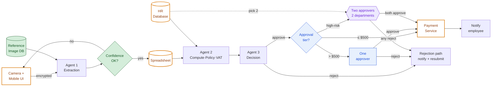

# Full Architecture — After All Steps

This is the consolidated view of the expense-reporting system **after every change from Steps 2–5 is applied**. Step 1 captured the original system (`01-system-overview.md`); this diagram shows what it becomes once the bug fix, human review, privacy controls, and the new capability are all in place. (Step 6 adds no components — it analyses the cost behaviour of the ones shown here.)

> The three agents (1, 2, 3) all call a **third-party LLM** governed by a **no-training clause in a DPA** (Step 4) — a cross-cutting dependency, kept out of the diagram to avoid clutter.

## What each colour means

- 🟩 **Green — Step 2 (bug fix).** The **Reference Image DB** is now consulted, and a **confidence gate** blocks low-confidence extractions before they reach the spreadsheet (routing them back to re-capture instead).
- 🟦 **Blue — Step 3 (human review).** The **approval gate** and the **one-approver** path: any approved expense over $500 is held for a human before payment.
- 🟪 **Purple — Step 5 (new capability).** The **two-approver / two-department** path for high-risk expenses, with the HR database consulted to pick the approvers.
- 🟨 **Yellow border — Step 4 (privacy).** Existing components that carry added privacy controls (detail kept out of the boxes to reduce clutter):
  - **Mobile UI / upload** — encrypted in transit;
  - **Spreadsheet** — encrypted, EU-hosted, retention-limited, minimal fields (no full card number);
  - **HR Database** — minimal read (role + status only);
  - **Payment Service** — minimal encrypted payload under a DPA, EU-based.
  - Plus the **third-party LLM** the agents call, bound by a no-training clause (noted under the diagram).

## End-to-end flow

The employee photographs a receipt and submits it over an encrypted connection. Agent 1 extracts the data, grounded against the Reference Image DB; low-confidence reads are sent back for re-capture, and only minimal, high-confidence fields are written to the spreadsheet. Agent 2 reads the spreadsheet plus a minimal slice of the HR database, computes the total and VAT, and checks policy. Agent 3 decides. A rejection returns to the employee; an approval enters the **tiered approval gate** — paid automatically if low-value, held for one approver above $500, or routed to two approvers in two different departments if it is high-risk (large amount, a reporting-line conflict of interest, or a high-fraud-risk category). Payment goes out only on full approval (any rejection blocks it), with a minimal encrypted payload to a DPA-bound, EU-based payment service. Throughout, the agents call a third-party LLM that is contractually barred from training on the data.
